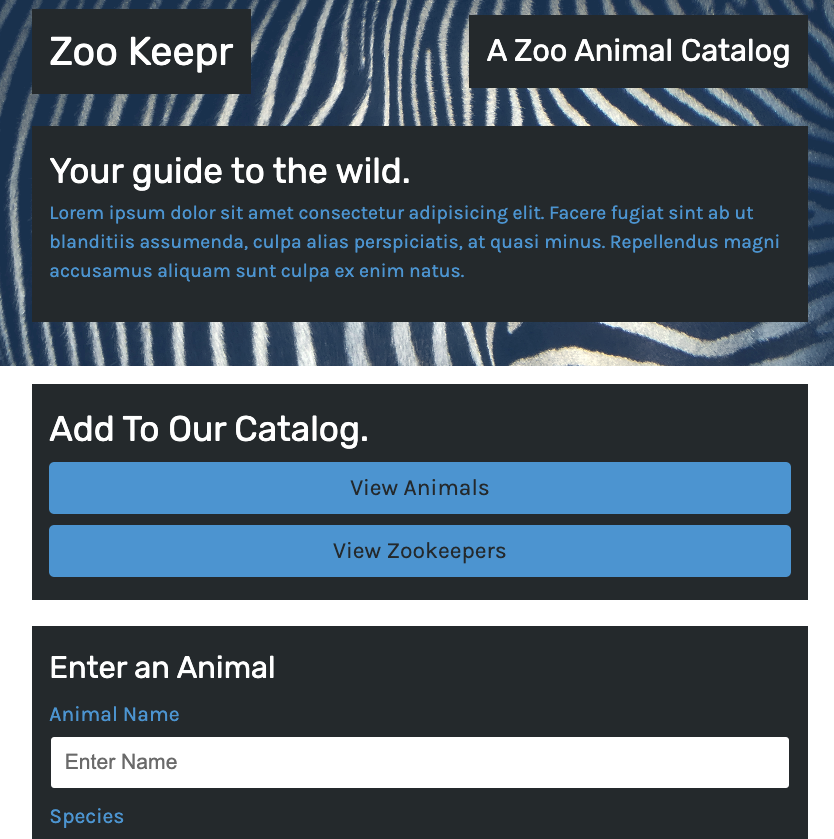

# Zookeepr

## Overview

The local zoo has received funding to build a new online catalog, and they've asked you to create a web server for a front-end application they’re developing, called Zoo Keepr. This site’s data will be stored on the server you create. This will allow animal enthusiasts to access the data from different locations and browsers without needing to download it to their device.

## Installation

1. Clone the code from Github
2. Install npm and all dependencies (express)

## Usage

1. Install npm: npm init -y
2. Install express: npm i express
3. Go to deployed link via Heroku (found below)
4. Click "Get Started" to go to the main note taker page
5. Write both a note and note text below, then hit the save button on the top right corner
6. You can add more notes by hitting the "+" sign in the top right corner
7. You can delete notes by hitting the trash icon beside the note you want to delete
